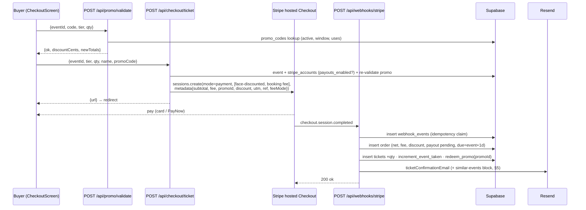
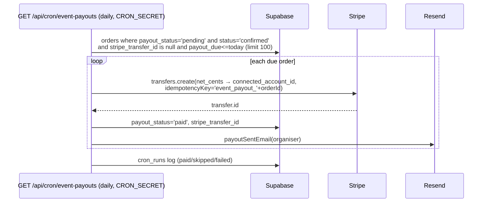

# Halal Events Marketplace Blueprint — Eventbrite-class, halal-first

**Date:** 2026-07-02
**Status:** implementation blueprint. **Extends (does not replace)** `docs/roadmap/events-ticketing-roadmap.md` (2026-06-27), which holds the competitive gap analysis vs Eventbrite/Eventsize and the QW/BB tagging. This document is the concrete build spec: routes, DDL, component names, money flow, and phased execution for turning humblehalal.com into the best halal event marketplace in Singapore.
**Audience:** site owner (technical) + future Claude Code sessions implementing later phases.
**Branch:** `feat/events-marketplace` (Phase 1 in flight). Latest applied migration at time of writing: `0043_ads_adsense.sql` (renamed from 0040 after colliding with master's `0040_booking_idempotency.sql`).

---

## Table of contents

- [0. Current state (summary)](#0-current-state-summary)
- [1. Information architecture & UX](#1-information-architecture--ux)
  - [1.1 Attendee journey audit vs the Eventbrite ideal](#11-attendee-journey-audit-vs-the-eventbrite-ideal)
  - [1.2 Proposed sitemap](#12-proposed-sitemap)
  - [1.3 Component hierarchy](#13-component-hierarchy)
- [2. Event schema & ticketing model](#2-event-schema--ticketing-model)
  - [2.1 Current tables](#21-current-tables)
  - [2.2 Phase-1 DDL (being implemented now)](#22-phase-1-ddl-being-implemented-now)
  - [2.3 Phase-B DDL (designed, not yet built)](#23-phase-b-ddl-designed-not-yet-built)
  - [2.4 TypeScript type sketches](#24-typescript-type-sketches)
  - [2.5 Conventions to follow](#25-conventions-to-follow)
- [3. Stripe Connect & fee model](#3-stripe-connect--fee-model)
  - [3.1 Current money flow (precise)](#31-current-money-flow-precise)
  - [3.2 Fee model with worked examples](#32-fee-model-with-worked-examples)
  - [3.3 Promo discounts — server-side, not Stripe coupons](#33-promo-discounts--server-side-not-stripe-coupons)
  - [3.4 PayNow](#34-paynow)
  - [3.5 Instant payouts (Phase B)](#35-instant-payouts-phase-b)
  - [3.6 Sequence diagrams](#36-sequence-diagrams)
  - [3.7 Handler pseudo-code stubs](#37-handler-pseudo-code-stubs)
- [4. Organizer dashboard & analytics](#4-organizer-dashboard--analytics)
- [5. Marketing & automation layer](#5-marketing--automation-layer)
  - [5.1 Flows](#51-flows)
  - [5.2 Claude prompt templates (ready to run)](#52-claude-prompt-templates-ready-to-run)
- [6. Review & trust system](#6-review--trust-system)
- [7. Phased roadmap](#7-phased-roadmap)
- [8. Go-live checklist for paid events](#8-go-live-checklist-for-paid-events)

---

## 0. Current state (summary)

Everything below is **built and verified in code** on this branch (paths relative to repo root):

**Attendee discovery & detail**
- `/events` discovery — `EventsScreen` (`components/screens/events.tsx:387`): text search + category chips (7 cats from `lib/events-data.ts` `eventCats`) + price segment (Free/Paid, shown only when `flags.paidTickets`) + area filter + gender-arrangement filter (`mixed|segregated|sisters|brothers`), featured rail.
- `/events/[slug]` detail — `app/events/[slug]/page.tsx` renders `EventDetailScreen` with **Event JSON-LD** (`eventJsonLd` + `breadcrumbJsonLd` from `components/seo/json-ld`), halal badges (`EventBadges`: `halalCatering` / `prayerNearby` / `genderArrangement`), a **prayer-aware banner** (`PrayerAwareBanner`, private component in `events.tsx:51` — flags salah-time overlap using `endTime`), **Hijri date chips** (`formatHijri` / `hijriSeason` from `lib/hijri.ts`), donation panel for charity events, organiser follow button, event ratings, Leaflet map, and a **sticky book bar** (`.detail-stickybar.evt-stickybar`, `events.tsx:820`).

**Booking & ticketing**
- Free RSVP: `POST /api/rsvp` — DB-backed order + ticket + QR (`qr_ref` UUID), capacity-safe via `increment_event_taken` RPC, degrades to `simulated:true` when Supabase isn't wired. RSVP confirmation email via Resend.
- Approval-gated events: `POST /api/events/[id]/join-request` — zero-migration design: a join request is a **pending order** (`status='pending'`, `amount_cents=0`); organiser approves/declines in the Requests tab.
- Paid: `POST /api/checkout/ticket` → **Stripe hosted Checkout**, `mode:'payment'`, **separate charges on the platform** (no `transfer_data`), two line items (face value + "Booking fee"), server-side kill-switch on `PAID_TICKETS_ENABLED`, capacity gate, requires organiser `stripe_accounts.payouts_enabled`.
- Fees: `lib/fees.ts` — buyer-side booking fee **5% of subtotal + S$0.50/ticket** (`FEE_PCT=0.05`, `FEE_PER_TICKET_CENTS=50`); organiser keeps 100% of face value. `computeOrder()` is the single source of truth.
- Connect: `POST /api/connect/onboard` — Stripe Connect **Express** hosted onboarding; `account.updated` webhook mirrors `charges_enabled` / `payouts_enabled` / `details_submitted` into `stripe_accounts`.
- Payouts: `GET /api/cron/event-payouts` (vercel.json cron, daily 06:30 UTC) — scans `orders` where `payout_status='pending' AND payout_due<=today AND stripe_transfer_id IS NULL`, `stripe.transfers.create` of `net_cents` to `connected_account_id` with idempotency key `event_payout_<orderId>`, flips `payout_status='paid'`, emails organiser. `payout_due = event date + 1 day`.
- Webhook: `app/api/webhooks/stripe/route.ts` — signed, idempotent (`webhook_events` insert; 23505 = duplicate; claim released on fulfillment failure so Stripe retries reprocess). Writes order (`net_cents`, `fee_cents`, `payout_status='pending'`, `payout_due`), creates `tickets` rows, atomic `increment_event_taken`, sends `ticketConfirmationEmail`. `charge.refunded` (full only) → refund order, void unused tickets, `decrement_event_taken`; donation refunds reversed too.
- QR tickets: client-generated, offline-capable; `MyTickets` + `TicketDetailScreen` (`components/screens/misc.tsx:1141/1231`, route `app/tickets/[id]/page.tsx`) with full-screen scannable QR, copy code, status, ICS, share.
- Door check-in: `CheckinScanner` (`components/screens/checkin.tsx:21`, route `/events/[slug]/checkin`) — BarcodeDetector camera scan + manual code entry, re-scan guard, `tickets.checked_in_at/checked_in_by` (migration `0020`).

**Organizer & ops**
- Command center: `EventManageScreen` (`components/screens/event-manage.tsx`) — tabs **overview** (stats + charts via `event-manage-charts.tsx`), **attendees** (+CSV export), **checkin**, **requests** (join-request approvals), **settings**. Host wizard: `HostEventScreen` (`events.tsx:1053`) with multi-tier tickets, capacity, refund policy, gender arrangement, prayer notes, OneMap address autocomplete.
- Event reviews with moderation: `event_reviews` (migration `0021`; `pending|published|rejected`, public views `v_event_reviews_public` / `v_event_rating`), honeypot + rate-limit in `app/api/events/[id]/reviews/route.ts`, AI triage cron (`/api/cron/review-triage`, migration `0034` guards). `organizer_follows` + `follower_count()` also in `0021`.
- Email: **35 Resend transactional templates** in `lib/emails/templates.ts` (ticket confirmation, RSVP, payout sent, reminders, …). Day-before reminder cron `GET /api/cron/event-reminders` (daily 01:00 UTC, Asia/Singapore date math, de-duped per recipient/event).
- Marketing: beehiiv newsletter capture with intent-tagged surfaces (`components/newsletter.tsx`, `app/api/subscribe`); weekly digest cron exists (`/api/cron/weekly-digest`).
- Ads: `event_featured` placement (migration `0023`, `0040` sets it `direct_only`) + **S$120 "Event Promotion"** product (`lib/ad-products.ts` → `"event-promotion": { cents: 12000 }`).
- SEO: `/events` + per-event URLs in `app/sitemap.ts`; per-event Event JSON-LD; `/ramadan` + `/hari-raya` seasonal hubs live.
- Data seam: `events` table structural columns + `events.display` jsonb (migration `0014`) merged by `rowToEvent()` (`lib/events-source.ts`); demo/mock events filtered by `isDemo`. `ticket_tiers` mirrored on event create (`app/api/events/route.ts:99`).

**What Phase 1 (this branch) is adding:** promo codes, pass/absorb fee choice, PayNow flag, category/town SEO landing pages, similar-events module, checkout cleanup (kill the decorative card field), first-touch attribution + `/e/[slug]` tracking links + organizer Marketing tab.

---

## 1. Information architecture & UX

### 1.1 Attendee journey audit vs the Eventbrite ideal

The Eventbrite gold standard: **landing → purchase in 2–3 clicks**, persistent CTA, no dead ends, every entry point (search, social, email) lands on a page that can convert.

| Journey step | Eventbrite ideal | Us today | Verdict / action |
|---|---|---|---|
| Land on event page | Rich page, persistent buy CTA | ✅ `EventDetailScreen` has a sticky book bar (`.evt-stickybar`) with price + CTA that follows scroll | Keep |
| Select tier + qty | Inline, 1 screen | ✅ Tier picker + qty on `/checkout` (`CheckoutScreen`, `events.tsx:838`) | Keep |
| Pay | Trusted, minimal | ⚠️ Redirect to **Stripe hosted Checkout** — kept **deliberately** (PCI scope, PayNow support, trust of stripe.com in SG). Embedded checkout is Phase C behind a flag. | Keep hosted for now |
| Friction: fake card field | n/a | ❌ `CheckoutScreen` renders a decorative "Card details" input (`placeholder="4242 4242 4242 4242"`, `events.tsx` ~line 983) that is **never charged** — confusing next to a real Stripe redirect | **Phase 1: remove**; replace with "You'll pay securely on Stripe (card or PayNow)" note |
| SEO entry points | Category + city landing pages capture non-brand search | ❌ Only `/events` + `/events/[slug]` + seasonal hubs. No `/events/c/*`, no `/events/in/*` | **Phase 1: build** (§1.2) |
| Organizer trust | Organizer profile w/ history, followers | ❌ Organiser name links nowhere; follows exist but no profile page | **Phase B: `/organizers/[slug]`** |
| Share → attribute | Tracked links | ❌ Bare URL shares only | **Phase 1: `/e/[slug]?ref=`** |
| Post-purchase | Wallet pass, reminders | ✅ QR + ICS + day-before email; wallet pass Phase C | OK |

Clicks-to-purchase today: event page → sticky CTA → `/checkout` (tier/qty/name) → Stripe → done. **3 interactions before payment — already at par.** The gap is *acquisition surface* (SEO pages, tracked shares, organizer profiles), not the funnel core.

### 1.2 Proposed sitemap

Target keywords pulled from `docs/seo/keyword-research.md` §K (verified volumes/KD) and §4 per-URL recommendations. Pattern precedent: `lib/seo-pages.ts` (programmatic area/venue/cuisine pages) — the events pages should mirror its `SeoPage` shape (slug, title ≤60 chars w/ `SEO_YEAR`, evergreen H1, intro, FAQ hooks).

| Route | Status | Target keywords (vol / KD) | Component | JSON-LD |
|---|---|---|---|---|
| `/events` | ✅ live | "halal events singapore", "ramadan bazaar singapore" (70/KD0), "hari raya bazaar" (90/KD0) — title per keyword doc §4: *"Halal Events in Singapore — Bazaars, Classes & Ta'lim"* | `EventsScreen` | `ItemList` of `Event` |
| `/events/c/[slug]` — 7 pages | 🔨 Phase 1 | per-category: `bazaar` → "ramadan bazaar singapore", "pasar malam"; `workshop` → "halal cooking class singapore"; `talk` → "islamic talks singapore", "ta'lim"; `community` → "muslim community events"; `charity` → "charity iftar", "zakat drive"; `business` → "muslim business networking singapore"; `youth` → "islamic youth camp singapore" | `EventSeoListing` (new) wrapping filtered `EventsScreen` grid | `CollectionPage` + `ItemList` |
| `/events/in/[slug]` — ~15 pages | 🔨 Phase 1 | "{town} events", "halal events {town}" — curate from `lib/sg-locations.ts` `towns` to areas with real supply: `geylang-serai`, `bugis` (Kampong Glam/Arab St), `tampines`, `bedok`, `woodlands`, `yishun`, `hougang`, `ang-mo-kio`, `pasir-ris`, `jurong-east`, `clementi`, `toa-payoh`, `marine-parade`, `punggol`, `sengkang` | `EventSeoListing` | `CollectionPage` + `ItemList` |
| `/events/[slug]` | ✅ live | event long-tail + brand | `EventDetailScreen` | `Event` (already) |
| `/organizers/[slug]` | 🔨 Phase B | "{organiser name}", "events by {organiser}" | `OrganizerProfile` (new) | `Organization` + `ItemList` |
| `/e/[slug]` | 🔨 Phase 1 | none — **tracking redirect**, `noindex`. `GET /e/[slug]?ref=wa-main` → `increment_ref_click` RPC + set `hh_attr` cookie → 302 to `/events/[slug]` | route handler `app/e/[slug]/route.ts` | none |
| `/ramadan` | ✅ live | "ramadan 2026" (10,000 / KD2), "when is ramadan 2026" (2,600), "ramadan calendar 2026" (1,500 / KD14) | seasonal hub | `WebPage` + FAQ |
| `/hari-raya` | ✅ live | "hari raya 2026" (16,000 / KD7), "eid al fitr 2026" (19,000 / KD6), "geylang serai bazaar" (2,000 / KD3) | seasonal hub | `WebPage` + FAQ |
| `/events/c/[cat]/in/[area]` | 🔮 Phase C | combined long-tail ("ramadan bazaar tampines") — **only render when ≥3 live events match** (thin-content guard) | `EventSeoListing` | `CollectionPage` |

Implementation notes for Phase-1 SEO pages:
- New `lib/events-seo.ts` exporting `EVENT_CATEGORY_PAGES` + `EVENT_TOWN_PAGES` (mirror `SeoPage` interface in `lib/seo-pages.ts`, reuse `SEO_YEAR`).
- Routes: `app/events/c/[slug]/page.tsx`, `app/events/in/[slug]/page.tsx` — `generateStaticParams` from the curated lists, `generateMetadata` with formula titles, add to `app/sitemap.ts`.
- Empty-state: town pages with zero upcoming events keep evergreen copy + "nearby towns" cross-links + newsletter capture (`components/newsletter.tsx` with `source` intent tag `events`) — same posture as `EXTRA_AREAS` districts in `lib/seo-pages.ts`.

### 1.3 Component hierarchy

```
Existing (verified)
├── EventsScreen                    components/screens/events.tsx:387   (/events)
│   ├── EventCard (variant row/card)             events.tsx:287
│   ├── EventBadges (halal/prayer/gender)        events.tsx:274
│   ├── EventPriceTag / EventDateChip            events.tsx:244/260
├── EventDetailScreen               events.tsx:535   (/events/[slug])
│   ├── PrayerAwareBanner (private)              events.tsx:51
│   ├── DonatePanel / FollowButton / EventRatings
│   └── sticky book bar (.evt-stickybar)
├── CheckoutScreen                  events.tsx:838   (/checkout)
├── HostEventScreen                 events.tsx:1053  (host wizard)
├── EventsStrip                     events.tsx:1390  (homepage rail)
├── MyTickets / TicketDetailScreen  components/screens/misc.tsx:1141/1231
├── CheckinScanner                  components/screens/checkin.tsx:21
└── EventManageScreen               components/screens/event-manage.tsx
    └── tabs: Overview · Attendees(+CSV) · Check-in · Requests · Settings

New — Phase 1
├── EventSeoListing                 components/screens/events-seo.tsx (category/town landing shell:
│                                   H1 + intro + filtered grid + FAQ + cross-links)
├── SimilarEvents                   components/similar-events.tsx (3-card rail on EventDetailScreen,
│                                   scorer in NEW lib/similar-events.ts — same catId +2, same area +2,
│                                   date within 30d +1, compatible genderArrangement +1)
├── Promo code input                inside CheckoutScreen (validate → show discount line)
└── Marketing tab                   new tab in EventManageScreen (§4)

New — Phase B
└── OrganizerProfile                components/screens/organizer-profile.tsx (/organizers/[slug]:
                                    logo, blurb, follower count via follower_count(), badge tier (§6),
                                    upcoming + past events, aggregate rating from v_organizer_rating)
```

---

## 2. Event schema & ticketing model

### 2.1 Current tables

All in `supabase/migrations/` (events core in `0001`, extended since):

| Table | Key columns | Notes |
|---|---|---|
| `events` | `id text PK`, `slug unique`, `business_id`, `is_free`, `capacity`, `taken`, `status(draft/pending/published/rejected)`, `date_iso`, **`display jsonb`** (0014) | **Key design decision:** `display` jsonb is the *runtime read model* — all rich `EventItem` fields (category, image, labels, venue, area, tiers, prayer/gender fields, donation totals) live there and are merged by `rowToEvent()` in `lib/events-source.ts`. Avoids 18 columns + migrations per UI field. |
| `ticket_tiers` | `event_id`, `name`, `price_cents`, `qty`, `sold` | **Mirror written on event create** (`app/api/events/route.ts:99`) as the structured source of truth for pricing; runtime reads still come from `display->tiers`. **Per-tier atomic inventory is deferred** — capacity is enforced at the event level (`increment_event_taken`), tier-level `sold` is not yet decremented at purchase. |
| `orders` | `event_id`, `business_id`, `buyer_email/name`, `amount_cents`, `fee_cents`, `net_cents`, `qty`, `status(pending/confirmed/refunded)`, `stripe_payment_intent`, `connected_account_id`, `payout_status(none/pending/paid/skipped/failed)`, `payout_due`, `stripe_transfer_id` (0016) | Join requests are pending orders with `amount_cents=0`. |
| `tickets` | `order_id`, `event_id`, `tier`, `qr_ref uuid`, `status(valid/used/refunded)`, `checked_in_at/by` (0020) | One row per admit. |
| `stripe_accounts` | `business_id PK`, `stripe_account_id`, `charges_enabled`, `payouts_enabled`, `details_submitted` | Synced by `account.updated` webhook. |
| `donations` (0019) | `event_id`, `amount_cents`, `stripe_payment_intent`, `status` | Running total mirrored to `display->donationRaisedCents` via `increment_donation_raised` RPC. |
| `event_reviews` (0021) | `event_id`, `rating 1–5`, `text`, `status(pending/published/rejected)` | Public via `v_event_reviews_public` / `v_event_rating` views. |
| `organizer_follows` (0021) | `(user_id, business_id) PK` | Public counts via `follower_count()` SECURITY DEFINER fn. |

### 2.2 Phase-1 DDL (being implemented now)

**Migration `0041_promo_codes.sql`** — promo/discount codes (matches Eventbrite "promo codes", roadmap Phase-1 QW):

```sql
-- 0041_promo_codes.sql — organiser promo codes for paid events. Idempotent.
create table if not exists promo_codes (
  id uuid primary key default gen_random_uuid(),
  event_id text not null references events(id) on delete cascade,
  code text not null,                       -- stored UPPERCASE; unique per event
  kind text not null default 'percent' check (kind in ('percent','fixed')),
  percent_off int check (percent_off between 1 and 100),
  amount_off_cents int check (amount_off_cents > 0),
  max_uses int,                             -- null = unlimited
  used int not null default 0,
  starts_at timestamptz,
  expires_at timestamptz,
  active boolean not null default true,
  created_at timestamptz not null default now(),
  unique (event_id, code)
);
alter table promo_codes enable row level security;
-- No anon/auth policies: validation + redemption go through service-role APIs only.

-- Atomic redemption: increments used ONLY while under max_uses (race-safe).
-- Returns true when redeemed, no row (null) when exhausted/inactive.
create or replace function public.redeem_promo(p_promo_id uuid)
returns boolean language sql volatile security definer set search_path = public as $$
  update promo_codes
     set used = used + 1
   where id = p_promo_id
     and active
     and (max_uses is null or used < max_uses)
     and (expires_at is null or expires_at > now())
  returning true;
$$;
revoke execute on function public.redeem_promo(uuid) from public, anon, authenticated;
grant execute on function public.redeem_promo(uuid) to service_role;
```

**Migration `0042_order_attribution.sql`** — attribution columns + tracking links (matches Eventbrite "tracking links" / Eventsize "source attribution"; enables pass/absorb fee choice):

```sql
-- 0042_order_attribution.sql — order attribution + organiser tracking links. Idempotent.
alter table if exists public.orders
  add column if not exists utm jsonb,          -- first-touch {source,medium,campaign,content,term}
  add column if not exists ref_code text,      -- /e/[slug]?ref=… code that led here
  add column if not exists session_id text,    -- hh_attr cookie session id (funnel joins)
  add column if not exists fee_mode text not null default 'pass'
    check (fee_mode in ('pass','absorb')),     -- who eats the booking fee (§3.2)
  add column if not exists promo_code_id uuid references promo_codes(id) on delete set null,
  add column if not exists discount_cents int not null default 0;

create table if not exists event_ref_codes (
  id uuid primary key default gen_random_uuid(),
  event_id text not null references events(id) on delete cascade,
  code text not null,                          -- short: 'wa-main', 'ig-story', 'share'
  label text,                                  -- organiser-facing: 'WhatsApp groups'
  clicks int not null default 0,
  created_at timestamptz not null default now(),
  unique (event_id, code)
);
alter table event_ref_codes enable row level security; -- service-role only

-- Service-role-only atomic click counter (0017/0029 pattern).
create or replace function public.increment_ref_click(p_event_id text, p_code text)
returns void language sql volatile security definer set search_path = public as $$
  update event_ref_codes set clicks = clicks + 1
   where event_id = p_event_id and code = p_code;
$$;
revoke execute on function public.increment_ref_click(text, text) from public, anon, authenticated;
grant execute on function public.increment_ref_click(text, text) to service_role;
```

### 2.3 Phase-B DDL (designed, not yet built)

Each block maps to the Eventbrite feature it matches. Number these `0043`–`0047` (adjust if intervening migrations land first).

**`0043_event_add_ons.sql`** — *Eventbrite: "add-ons" (merch, meals, parking)*. Rationale: sell non-admission items alongside tickets; `order_items` also unlocks itemised receipts for multi-tier orders.

```sql
create table if not exists event_add_ons (
  id uuid primary key default gen_random_uuid(),
  event_id text not null references events(id) on delete cascade,
  name text not null,                 -- 'Kids meal box', 'Event tee (M)'
  price_cents int not null default 0,
  qty int not null default 0,         -- 0 = unlimited
  sold int not null default 0,
  active boolean not null default true
);
create table if not exists order_items (
  id uuid primary key default gen_random_uuid(),
  order_id uuid not null references orders(id) on delete cascade,
  kind text not null check (kind in ('ticket','add_on')),
  ref_id text,                        -- tier name (tickets) or event_add_ons.id
  name text not null,
  qty int not null default 1,
  unit_cents int not null default 0
);
create index if not exists order_items_order_idx on order_items(order_id);
```

**`0044_event_questions.sql`** — *Eventbrite: "custom registration questions"*. Rationale: answers stored as one jsonb on the order — **PDPA-simple** (delete the order → answers gone with it, no orphaned PII table); CSV export spreads jsonb keys into columns.

```sql
create table if not exists event_questions (
  id uuid primary key default gen_random_uuid(),
  event_id text not null references events(id) on delete cascade,
  prompt text not null,               -- 'Dietary requirements?'
  kind text not null default 'text' check (kind in ('text','select','checkbox')),
  options jsonb,                      -- ["No nuts","Vegetarian"] for select/checkbox
  required boolean not null default false,
  position int not null default 0
);
alter table orders add column if not exists answers jsonb;  -- {question_id: answer}
```

**`0045_event_waitlist.sql`** — *Eventbrite: "waitlists with auto-release"*. Rationale: capture demand on sold-out events; cron invites `waiting` rows FIFO when capacity frees (refunds), invite expires after 24h.

```sql
create table if not exists event_waitlist (
  id uuid primary key default gen_random_uuid(),
  event_id text not null references events(id) on delete cascade,
  email text not null,
  name text,
  qty int not null default 1,
  status text not null default 'waiting'
    check (status in ('waiting','invited','converted','expired')),
  invited_at timestamptz,
  created_at timestamptz not null default now(),
  unique (event_id, email)            -- one spot in line per email per event
);
create index if not exists event_waitlist_scan_idx on event_waitlist(event_id, status, created_at);
```

**`0046_tier_windows_instant_payouts.sql`** — *Eventbrite: "early bird / scheduled ticket types"* + our beat-Eventbrite instant payouts. Rationale: sale windows on the existing `ticket_tiers` mirror (checkout rejects out-of-window tiers server-side); `trusted` is an admin allowlist that flips `payout_due` to now (§3.5).

```sql
alter table ticket_tiers
  add column if not exists starts_at timestamptz,   -- early-bird opens
  add column if not exists ends_at timestamptz,     -- early-bird closes
  add column if not exists active boolean not null default true;

alter table stripe_accounts
  add column if not exists trusted boolean not null default false;  -- admin-set allowlist
```

**`0047_verified_reviews.sql`** — *beats Eventbrite: verified halal-experience reviews (§6)*. Rationale: `order_id` link proves attendance; partial unique index = one review per order; `dims` jsonb keeps halal dimensions schema-flexible.

```sql
alter table event_reviews
  add column if not exists verified boolean not null default false,
  add column if not exists order_id uuid references orders(id) on delete set null,
  add column if not exists dims jsonb;  -- {halalFood: bool, prayerSpace: 1-5, asDescribed: bool}
create unique index if not exists event_reviews_order_uniq
  on event_reviews(order_id) where order_id is not null;

-- Organiser reputation: published + verified reviews only.
create or replace view public.v_organizer_rating as
  select e.business_id,
         round(avg(er.rating)::numeric, 1)               as avg_rating,
         count(*)::int                                    as review_count,
         round(100.0 * avg(case when (er.dims->>'halalFood')::boolean then 1 else 0 end)
               filter (where er.dims ? 'halalFood'))::int as halal_as_promised_pct,
         round(avg((er.dims->>'prayerSpace')::numeric)
               filter (where er.dims ? 'prayerSpace'), 1) as prayer_space_avg
  from event_reviews er
  join events e on e.id = er.event_id
  where er.status = 'published' and er.verified
  group by e.business_id;
```

### 2.4 TypeScript type sketches

Follow `lib/types.ts` conventions (interfaces, optional Islamic-layer fields, doc comments). `EventTier` gains sale windows:

```ts
// lib/types.ts (extend existing)
export interface EventTier {
  name: string;
  price: number;
  perks: string;
  /** ISO datetimes — tier only purchasable inside the window (Phase B). */
  startsAt?: string;
  endsAt?: string;
}

export interface PromoCode {
  id: string;
  eventId: string;
  code: string;                       // always UPPERCASE
  kind: "percent" | "fixed";
  percentOff?: number;                // 1–100 when kind='percent'
  amountOffCents?: number;            // when kind='fixed'
  maxUses?: number | null;
  used: number;
  startsAt?: string;
  expiresAt?: string;
  active: boolean;
}

export interface RefCode {
  id: string;
  eventId: string;
  code: string;                       // 'wa-main'
  label?: string;                     // 'WhatsApp groups'
  clicks: number;
}

export interface AddOn {
  id: string;
  eventId: string;
  name: string;
  priceCents: number;
  qty: number;                        // 0 = unlimited
  sold: number;
  active: boolean;
}

export interface EventQuestion {
  id: string;
  eventId: string;
  prompt: string;
  kind: "text" | "select" | "checkbox";
  options?: string[];
  required: boolean;
  position: number;
}
```

### 2.5 Conventions to follow

- **Event ids are text**: `` `evt_${randomUUID().slice(0, 12)}` `` (`app/api/events/route.ts:76`); validate inbound refs with `isSafeEventRef` (`lib/event-ref.ts`) before interpolating into `.or()` filters.
- **RLS with Clerk**: policies use `(auth.jwt() ->> 'sub')` (TEXT Clerk ids) — migration `0031` rewrote all `auth.uid()` policies; never write new policies with `auth.uid()`.
- **Counter RPCs are service-role-only** (0017/0029 pattern): `SECURITY DEFINER`, `revoke ... from public, anon, authenticated; grant ... to service_role;`. All new counters (`redeem_promo`, `increment_ref_click`) follow it.
- **Additive migrations only**: `create table if not exists`, `add column if not exists`, `drop policy if exists` + recreate. Never destructive; each migration idempotent + runnable standalone.
- **Graceful degradation**: every API no-ops/simulates when Stripe/Supabase env is absent (project posture: "Supabase last, graceful APIs").
- **`display` jsonb first**: new attendee-facing event fields go into `display` and `rowToEvent()`, not new columns — columns are for things the DB must index/enforce (money, status, dates, counters).

---

## 3. Stripe Connect & fee model

### 3.1 Current money flow (precise)

1. `POST /api/checkout/ticket` creates a hosted Checkout Session, `mode:'payment'`, **on the platform account** (no `transfer_data`, no `application_fee_amount`) with **two line items**: `{event title — tier} × qty` at face value + `Booking fee × 1`. All order math is stuffed into session + payment-intent `metadata` (`kind:'ticket'`, `eventId`, `businessId`, `tier`, `qty`, `subtotalCents`, `feeCents`, `connectedAccount`, `buyer`).
2. `checkout.session.completed` webhook writes the `orders` row: `amount_cents = total`, `fee_cents`, `net_cents = subtotal`, `payout_status = 'pending'` (when a connected account exists and subtotal > 0), `payout_due = event.date_iso + 1 day` (fallback: purchase + 1 day for events without a DB row); creates `qty` ticket rows with UUID `qr_ref`s; `increment_event_taken`; sends confirmation email.
3. Daily cron `GET /api/cron/event-payouts` scans due pending orders (`stripe_transfer_id IS NULL` belt-and-suspenders) and calls `stripe.transfers.create({ amount: net_cents, destination: connected_account_id })` with **idempotency key `event_payout_<orderId>`** — a retried transfer can never double-pay. Success → `payout_status='paid'` + `stripe_transfer_id` + payout email; failure → stays `pending` for next run.
4. Full refunds (`charge.refunded` with `charge.refunded===true`): order → `refunded`, unused tickets voided, `decrement_event_taken`. Partial refunds are deliberately a no-op.

**Net position:** Humble Halal holds face + fee for ~event duration + 1 day, then pays organiser 100% of face; the booking fee is gross commission out of which we pay Stripe processing (~3.4% + S$0.50 on the *total* in SG).

### 3.2 Fee model with worked examples

`lib/fees.ts`: `fee = round(subtotal × 5%) + S$0.50 × qty`. Phase 1 adds `fee_mode` per event (organiser chooses in `HostEventScreen` / Settings tab; stored on the order at purchase time):

**Example: S$20 ticket × 2 (subtotal S$40.00; fee = 5% × 40 + 2 × 0.50 = S$3.00)**

| Mode | Buyer pays | Organiser nets | Us (gross) | Checkout mechanics |
|---|---|---|---|---|
| **pass** (default, current behaviour) | **S$43.00** (40.00 + 3.00) | **S$40.00** | S$3.00 | Two line items (face + "Booking fee"); `net_cents = subtotal` |
| **absorb** | **S$40.00** | **S$37.00** (40.00 − 3.00) | S$3.00 | Single line item at face; `net_cents = subtotal − feeCents` |

vs **Eventbrite Singapore** (2025–2026 research; re-verify before publishing comparisons): service fee ≈ 3.5% + S$0.99 **per ticket** + payment processing ≈ 3.9% — on this order ≈ S$5.36 buyer-side, and organisers wait ~4–5 days post-event for payouts. We are cheaper on typical community price points (the flat S$0.99/ticket is what kills S$5–20 tickets), payout in 24h, and free events are 100% free.

Implementation notes:
- `computeOrder()` stays the single source of truth; add `feeMode` param (or a sibling `computeOrderAbsorb()`) rather than duplicating math in the route.
- In absorb mode the webhook must set `net_cents = subtotal − fee` — the payout cron needs **no change** (it just transfers `net_cents`).
- Fee is computed on the **discounted** subtotal when a promo applies (below).

### 3.3 Promo discounts — server-side, not Stripe coupons

Discounts are **pre-computed server-side** in `/api/checkout/ticket` and baked into the line items. We do **not** use Stripe Coupons/Promotion Codes because a Stripe-side discount applies at session level across *both* line items — it would corrupt the two-line-item fee/payout math (`subtotalCents`/`feeCents` metadata would no longer match what was charged, and the payout cron would over-transfer).

Flow:
1. `POST /api/promo/validate` `{eventId, code, qty, tier}` → checks `promo_codes` (active, window, `used < max_uses`) → returns `{ok, promoId, discountCents, newTotals}`. Client shows the discount line.
2. Checkout route re-validates server-side (never trust the client), computes `discountedSubtotal = max(0, subtotal − discount)`, fee on the discounted subtotal, and adds `promoId` + `discountCents` to metadata. Face line item shows the discounted unit price; description notes the code.
3. Webhook: after order insert, call `redeem_promo(promoId)` (atomic, race-safe); write `promo_code_id` + `discount_cents` on the order. If `redeem_promo` returns no row (sniped last use between validate and pay), still honour the order — the organiser set the cap for marketing, not inventory.
4. **Discount-to-zero** (100% off / fixed ≥ subtotal): do not create a S$0 Stripe session — fall through to the **free RSVP flow** (`/api/rsvp` path) with the promo recorded on the order. Fee is 0 (`bookingFeeCents` already returns 0 for subtotal ≤ 0).

### 3.4 PayNow

The clearest beat-Eventbrite move in SG (Eventbrite has no PayNow; Eventsize does — see roadmap §7). PayNow QR is how SG community groups already pay each other; removing card friction materially lifts conversion for S$5–30 community tickets, and its fees are lower than cards (improves our net on the booking fee).

- Stripe supports PayNow natively in SG: add `payment_method_types: ['card','paynow']` to the Checkout Session. Constraint: **one-time `mode:'payment'` only** (fine — tickets are one-time; do NOT add to subscription/plan checkouts), SGD only.
- Gate behind `PAYNOW_ENABLED` env flag (add to `lib/flags.ts` following `paidTickets` pattern; default off).
- **Resilience:** wrap `sessions.create` in try/catch — if Stripe rejects (PayNow not yet activated on the account), retry once with `['card']` only and log. Ship the code path before the dashboard activation so flipping the flag is the only go-live step.
- Ops note: PayNow payments settle asynchronously-but-fast; `checkout.session.completed` still fires on success, so **webhook and payout code need zero changes**.

### 3.5 Instant payouts (Phase B)

- `stripe_accounts.trusted` (migration `0046`) is an **admin-set allowlist** (Admin screen toggle; no self-serve) for established organisers — mosques, known community orgs, organisers with ≥N clean events.
- Behaviour: when `trusted`, the webhook sets `payout_due = today` instead of event+1d; the daily cron pays it on its next run (≤24h). No new payout code path.
- **Chargeback risk note:** paying before the event means a cancelled/fraudulent event leaves us out-of-pocket (buyer disputes land on the platform in separate-charges model). Hence: allowlist-only, flag `INSTANT_PAYOUTS_ENABLED` **default OFF**, and cap trusted instant exposure (e.g. skip instant when `net_cents > S$2,000` per order until we have history).

### 3.6 Sequence diagrams

**(1) Paid checkout with promo**



**(2) Payout cron**



### 3.7 Handler pseudo-code stubs

```ts
// app/api/promo/validate/route.ts (Phase 1, NEW)
POST(req):
  rateLimit(req, "promo", 20/hr)
  { eventId, code, tier, qty } = body; code = code.trim().toUpperCase()
  promo = supa.from("promo_codes").select().eq("event_id", eventId).eq("code", code)
            .eq("active", true).maybeSingle()
  if (!promo || windowClosed(promo) || (promo.max_uses && promo.used >= promo.max_uses))
      return { ok: false, reason: "invalid_code" }        // one generic reason — no enumeration
  face = resolveTierPrice(eventId, tier)                   // server-side, never client price
  discount = promo.kind === "percent"
      ? Math.round(face * qty * promo.percent_off / 100)
      : Math.min(promo.amount_off_cents, face * qty)
  return { ok: true, promoId: promo.id, discountCents: discount,
           order: computeOrder(face, qty, { discount, feeMode: ev.feeMode }) }
```

```ts
// app/api/checkout/ticket/route.ts (Phase-1 delta only)
POST(req):
  …existing guards (flag, stripe, event, capacity, connect payouts_enabled)…
  promo = body.promoCode ? revalidatePromo(ev.id, body.promoCode, tier, qty) : null
  discounted = Math.max(0, subtotal − (promo?.discountCents ?? 0))
  if (discounted === 0) return { ok: false, reason: "free_after_discount" }  // client → /api/rsvp path
  fee = bookingFeeCents(discounted, qty)
  lineItems = ev.feeMode === "absorb"
      ? [face(discountedUnit, qty)]                        // buyer pays face only
      : [face(discountedUnit, qty), bookingFee(fee)]
  meta += { promoId, discountCents, feeMode, utm: cookie("hh_attr"), refCode, sessionId }
  meta.subtotalCents = discounted                          // organiser net basis
  meta.feeCents = fee
  session = stripe.checkout.sessions.create({
    payment_method_types: flags.paynow ? ["card","paynow"] : ["card"],  // try/catch → card-only retry
    …existing success/cancel urls…
  })
```

```ts
// app/api/webhooks/stripe/route.ts — ticket branch (Phase-1 delta only)
case "checkout.session.completed" (kind === "ticket"):
  …existing order insert, plus:
  fee_mode: m.feeMode, promo_code_id: m.promoId || null,
  discount_cents: int(m.discountCents), utm: parseJson(m.utm),
  ref_code: m.refCode || null, session_id: m.sessionId || null,
  net_cents: m.feeMode === "absorb" ? subtotal − fee : subtotal,
  payout_due: acctTrusted ? today : eventDate + 1d          // Phase B
  if (m.promoId) supa.rpc("redeem_promo", { p_promo_id: m.promoId })  // best-effort
```

---

## 4. Organizer dashboard & analytics

### 4.1 Computable TODAY (no new capture)

| Metric | Source | Where it goes |
|---|---|---|
| Event-page views over time | `analytics_events` `page_view` rows filtered on `p_path = /events/[slug]` (`lib/analytics.ts` `emit()` → RPC, migration `0010/0011`) | Overview tab chart |
| Sales over time / revenue | `orders` (`created_at`, `amount_cents`, `net_cents`, `status='confirmed'`) | Overview tab (already partially there via `event-manage-charts.tsx`) |
| Tier breakdown | `tickets.tier` grouped per event | Overview tab |
| Check-in rate | `tickets.checked_in_at IS NOT NULL / count` | Check-in tab live counter (exists) |
| **Repeat-attendee %** | `orders.buyer_email` for this event ∩ buyer_emails from the organiser's earlier events | New stat card — "34% of your attendees have been to your events before" |
| Donations raised | `donations` + `display->donationRaisedCents` | Overview (charity events) |

### 4.2 What Phase-1 capture adds

- **`hh_attr` first-touch cookie** (new `lib/attribution.ts` + small client hook): on first landing with `utm_*` params or via `/e/[slug]?ref=`, store `{utm:{source,medium,campaign,content,term}, ref, sid, ts}` (30-day cookie, first-touch wins). Checkout route reads it into order metadata → webhook persists to `orders.utm/ref_code/session_id`.
- **`/e/[slug]?ref=` tracking links** (`app/e/[slug]/route.ts`): `increment_ref_click` RPC + set cookie + 302 → `/events/[slug]`. Organiser mints codes in the Marketing tab (rows in `event_ref_codes`).
- **`checkout_start` analytics event**: new `p_event_type` emitted from `CheckoutScreen` mount / sticky-bar CTA (extend the `track` object in `lib/analytics.ts` alongside `page_view`/`listing_view`). Completes the funnel: views → checkout_start → orders.

### 4.3 Marketing tab (new tab in `EventManageScreen`) — text wireframe

```
┌─ Marketing ───────────────────────────────────────────────────────────────┐
│ Tracking links                                            [ + New link ]  │
│  ┌──────────────────────────────────────────────────────────────────────┐ │
│  │ wa-main   WhatsApp groups    …/e/nasi-padang?ref=wa-main             │ │
│  │           214 clicks · 18 orders · S$864.00      [Copy] [WA] [TG]    │ │
│  │ ig-story  Instagram story    …/e/nasi-padang?ref=ig-story            │ │
│  │           89 clicks · 3 orders · S$144.00        [Copy] [WA] [TG]    │ │
│  └──────────────────────────────────────────────────────────────────────┘ │
│  [WA] = wa.me share prefill · [TG] = t.me/share prefill (§5.1)            │
│                                                                           │
│ Sales by channel (first touch)                                            │
│  whatsapp   512 views   40 checkouts   22 orders   S$1,056.00             │
│  instagram  260 views   11 checkouts    4 orders   S$192.00               │
│  direct/seo 1,068 views 71 checkouts   21 orders   S$1,008.00             │
│                                                                           │
│ Funnel        1,840 views → 122 checkout starts → 47 orders               │
│               view→checkout 6.6% · checkout→order 38.5% · overall 2.6%    │
│                                                                           │
│ Promo codes                                              [ + New code ]   │
│  EARLYBIRD  20% off · 12/50 used · expires 10 Aug        [Deactivate]     │
└───────────────────────────────────────────────────────────────────────────┘
```

### 4.4 `GET /api/events/[id]/marketing` response shape

Organiser/admin-auth'd (same guard as `/api/events/[id]/stats`):

```json
{
  "ok": true,
  "refLinks": [
    { "code": "wa-main", "label": "WhatsApp groups",
      "url": "https://www.humblehalal.com/e/nasi-padang-masterclass?ref=wa-main",
      "clicks": 214, "orders": 18, "revenueCents": 86400 }
  ],
  "channels": [
    { "channel": "whatsapp", "views": 512, "checkoutStarts": 40, "orders": 22, "revenueCents": 105600 },
    { "channel": "direct",   "views": 1068, "checkoutStarts": 71, "orders": 21, "revenueCents": 100800 }
  ],
  "funnel": { "views": 1840, "checkoutStarts": 122, "orders": 47, "conversionPct": 2.6 },
  "promos": [
    { "code": "EARLYBIRD", "kind": "percent", "percentOff": 20,
      "used": 12, "maxUses": 50, "discountCents": 14400, "active": true }
  ]
}
```

### 4.5 Audience insights (Phase B+) — and the PDPA line

- **Returning vs new attendees** (buyer_email history across the organiser's events) and **area distribution** (join orders → events.display->area of previously attended events) — both derivable from data attendees already gave us for the transaction.
- **Explicitly NOT doing** demographics beyond that: no age/gender/race inference, no profiling, no third-party enrichment. PDPA purpose-limitation: attendees gave an email to receive a ticket, not to be profiled. This is also brand posture — trust is the product (§6).

---

## 5. Marketing & automation layer

### 5.1 Flows

| Flow | Mechanics | Phase |
|---|---|---|
| **Post-event thank-you + review request** | New cron `GET /api/cron/post-event-emails` (daily, after `event-reminders` pattern): events with `date_iso = yesterday` → email every confirmed buyer a thank-you + review deep link `/events/[slug]?review=<HMAC token>`. Token = `HMAC-SHA256(orderId|eventId, REVIEW_TOKEN_SECRET)` → review API verifies + marks review `verified` + binds `order_id` (§6). De-dupe per recipient/event like `event-reminders`. | B |
| **Similar-events blocks in confirmation emails** | Reuse the **new `lib/similar-events.ts`** scorer (same catId +2, same area +2, date within 30d +1, compatible `genderArrangement` +1) — same module that powers the `SimilarEvents` rail on `EventDetailScreen`. Append top-3 to `ticketConfirmationEmail` / `rsvpConfirmationEmail` in `lib/emails/templates.ts`. Pure server-side, zero new infra. | 1 |
| **Organizer broadcast** | "Email my attendees" from the Marketing tab: **2 sends max per event** (hard server limit), audit table `organizer_broadcasts` (event_id, subject, body_hash, sent_count, created_at), mandatory unsubscribe footer honouring a suppression list, admin-visible log. Content passes through the same moderation posture as reviews (no spam guarantee to attendees). | B |
| **Beehiiv events digest** | Config-mostly: (a) capture surfaces already tag intent — ensure events surfaces pass `source='events'` to `components/newsletter.tsx` → beehiiv automation keyed on the `events` intent tag sends a welcome sequence; (b) add an "events this week" section to the existing `/api/cron/weekly-digest` (Thursday 09:00 UTC) sourced from `getEvents()` next-7-days. | C (config) |
| **WhatsApp share prefills** | Every share button (event page, ticket success, Marketing tab) links `https://wa.me/?text=<encoded copy + https://www.humblehalal.com/e/[slug]?ref=share>` — shares are attributable by default. Telegram: `https://t.me/share/url?url=…&text=…`. | 1 |

### 5.2 Claude prompt templates (ready to run)

Stored here so organisers/admin (or a future in-product "Write with AI" button calling the AI gateway) can use them verbatim. Placeholders in `{{ }}`.

**(a) Event description from bullet points — halal-aware**

```text
You write event descriptions for Humble Halal, Singapore's halal events platform.
Audience: Singapore Muslim families and young professionals. Tone: warm, concrete,
community-first. Never salesy, never exaggerated, no emoji spam (max 2).

Write an event description (120–180 words) plus a one-line teaser (max 140 chars)
from these details:

Title: {{event_title}}
Category: {{category}}            (bazaar / workshop / talk / community / charity / business / youth)
Date & time: {{date_time}}        End time: {{end_time}}
Venue & area: {{venue}}, {{area}}
Price: {{price_or_free}}
Key points: {{bullet_points}}

Halal-aware requirements — weave in naturally, only if provided (never invent):
- Halal catering status: {{halal_catering_note}}   (e.g. "MUIS-certified caterer")
- Prayer arrangement: {{prayer_note}}              (e.g. "prayer space on level 2;
  we pause for Maghrib at {{maghrib_time}}")
- Gender arrangement: {{gender_arrangement}}       (mixed / segregated / sisters-only /
  brothers-only — state it plainly and respectfully)
- Family-friendliness: {{family_note}}             (kids' corner, stroller access…)

Rules: open with what attendees will experience, not the organiser. Mention the area
name once for local search. End with a single clear call to action. British English.
Do NOT claim halal certification unless it appears in the details above.
```

**(b) Announcement + reminder + post-event thank-you emails**

```text
You write transactional-adjacent emails for Humble Halal events. Plain, warm,
mobile-first: subject ≤45 chars, preheader ≤80 chars, body ≤150 words, one button.
Assalamu alaikum greeting; sign off "— {{organiser_name}} & the Humble Halal team".

Event: {{event_title}} · {{date_time}} · {{venue}}, {{area}}
Ticket link: {{ticket_url}}
Halal notes: {{halal_catering_note}} / {{prayer_note}} / {{gender_arrangement}}

Write THREE emails:

1) ANNOUNCEMENT (to the organiser's followers): why this event is worth their
   weekend, the halal/prayer details as reassurance, CTA "Get tickets".

2) REMINDER (24h before, to ticket holders): what to bring, arrival time,
   {{checkin_note|e.g. "have your QR ready — screenshot works offline"}}, prayer
   timing note if the event spans salah, CTA "View my ticket".

3) THANK-YOU (day after, to attendees): gratitude, one highlight ({{highlight}}),
   invite an honest review — "Was the food as promised? Was the prayer space
   adequate?" — CTA "Leave a review" ({{review_url}}), soft mention of
   {{next_event_title}} if provided.

Return each as: Subject / Preheader / Body (markdown).
```

**(c) WhatsApp broadcast message (SG tone, <300 chars)**

```text
Write a WhatsApp group message for a Singapore Muslim community audience promoting
this event. Under 300 characters INCLUDING the link. Sound like a real person
forwarding something good, not an ad. One emoji max. Mention the area, the date in
"Sat 14 Mar" style, and price ("Free" if free). If sisters-only or family-friendly,
lead with that. End with the link on its own line.

Event: {{event_title}} · {{date_short}} · {{area}} · {{price_or_free}}
Angle: {{one_line_hook}}
Link: https://www.humblehalal.com/e/{{slug}}?ref=wa-main
```

**(d) IG/TikTok caption set + thumbnail concept**

```text
Create social assets for a Singapore halal event. Audience: 20–40s SG Muslims on
IG/TikTok. No haram-adjacent tropes; keep it modest, energetic, local (it's ok to
use light Singlish — "confirm worth it" — sparingly).

Event: {{event_title}} · {{date_time}} · {{venue}}, {{area}} · {{price_or_free}}
Selling points: {{bullet_points}}
Halal notes: {{halal_catering_note}} / {{prayer_note}} / {{gender_arrangement}}

Deliver:
1) IG caption (≤125 chars before the fold) + 5 niche hashtags (mix: #halalsg
   #sgmuslims + 3 event-specific) + CTA "link in bio".
2) TikTok caption (≤100 chars) + 3 hashtags.
3) 3 TikTok hook lines (first 2 seconds, spoken) — e.g. "POV: you found a
   {{category}} in {{area}} that's actually fully halal".
4) THUMBNAIL CONCEPT: one sentence describing the hero image (subject, angle,
   text overlay ≤4 words, colour mood matching a warm gold/green palette).
   No AI-generated food imagery — describe a real photo the organiser can take.
```

---

## 6. Review & trust system

### 6.1 Verified-attendee reviews

Two verification paths (Phase B, migration `0047`):
1. **HMAC token deep link** from the post-event email (§5.1): `/events/[slug]?review=<token>`; the review API (`app/api/events/[id]/reviews/route.ts`) verifies `HMAC(orderId|eventId, REVIEW_TOKEN_SECRET)`, sets `verified=true`, `order_id=<order>`. Partial unique index → **one review per order**. No account needed — matches our no-login ticket posture.
2. **Order-match for signed-in users**: Clerk user whose email matches a confirmed order on the event → `verified=true` on submit.

Anonymous reviews stay allowed (community voice) but remain `pending` until moderation and are **excluded from reputation aggregates** — only `verified` + `published` rows feed `v_organizer_rating`.

### 6.2 Halal-experience dimensions

`event_reviews.dims` jsonb, prompted only for verified reviewers:

| Dim | Type | Question |
|---|---|---|
| `halalFood` | bool | "Was the food halal as promised?" |
| `prayerSpace` | 1–5 | "How adequate was the prayer arrangement?" |
| `asDescribed` | bool | "Was the event (incl. gender arrangement) as described?" |

Aggregates surface on event pages and organizer profiles as plain-language stats: **"96% said halal food was as promised" · "Prayer space rated 4.6/5"** — computed in `v_organizer_rating` (`halal_as_promised_pct`, `prayer_space_avg`).

### 6.3 Organizer reputation

On `/organizers/[slug]` (`OrganizerProfile`) and event detail:

| Badge | Criteria (from `v_organizer_rating` + events history) |
|---|---|
| **New organiser** | < 3 completed events |
| **Rising** | ≥ 3 completed events AND avg_rating ≥ 4.0 |
| **Trusted** | ≥ 10 completed events AND ≥ 20 verified reviews AND avg_rating ≥ 4.5 |

Plus: follower count (`follower_count()` fn, 0021), events hosted, halal-dim percentages. "Trusted" is also the natural gate for the instant-payout allowlist (§3.5) — one trust ladder, two rewards.

### 6.4 Anti-spam (mostly exists)

- Honeypot field + rate limit (8/hr) already in the reviews API; moderation queue (`pending` default) already in 0021; AI triage cron already running (`/api/cron/review-triage`, guards in 0034).
- Phase B adds: only `verified` rows feed reputation (spam can't move the number), one-review-per-order index, and HMAC tokens that expire (embed `ts`, reject > 30 days).

### 6.5 Why this beats generic Eventbrite/Meetup reviews for Muslim audiences

**Trust is THE purchase blocker for halal claims.** On Eventbrite an organiser can write "halal food provided" with zero accountability — a Muslim attendee has no way to know if that meant MUIS-certified catering or "no pork, no lard" hopeful labelling, and no recourse shapes the organiser's next event. Our loop closes this:

1. **Certification layer** (MUIS deep-links, Cert Vault, Muslim-owned signals) sets the *claim*;
2. **Verified attendees** confirm the claim was *kept* ("halal food as promised" %) — community verification compounding on certification;
3. **Gender-arrangement accuracy accountability**: sisters-only / segregated events are trust-critical in a way generic platforms never model — `asDescribed` makes misrepresentation visible and reputationally expensive;
4. Aggregates feed the badge ladder → **organisers are economically rewarded (instant payouts, Trusted badge, better conversion) for keeping halal promises.** Eventbrite structurally cannot copy this without our audience density and halal-first data model.

---

## 7. Phased roadmap

Legend: 🤖 = automatable by Claude Code agents (schema gen, scaffolding, email drafting) · 👤 = needs human/business action.

### Phase 1 — revenue levers + acquisition (NOW, branch `feat/events-marketplace`)

| Item | Detail | Who |
|---|---|---|
| Promo codes | Migration `0041`, `/api/promo/validate`, checkout integration (§3.3), Marketing-tab CRUD | 🤖 |
| Pass/absorb fee choice | `fee_mode` on orders (0042), `HostEventScreen`/Settings toggle, checkout line-item switch (§3.2) | 🤖 |
| PayNow flag | `payment_method_types` + `PAYNOW_ENABLED` + card-only retry (§3.4) | 🤖 code / 👤 Stripe dashboard activation |
| SEO pages | `/events/c/[slug]` ×7 + `/events/in/[slug]` ×~15 via `lib/events-seo.ts` + `EventSeoListing`; sitemap entries (§1.2) | 🤖 |
| Similar events | `lib/similar-events.ts` + `SimilarEvents` rail + confirmation-email block (§5.1) | 🤖 |
| Checkout cleanup | Remove decorative card field from `CheckoutScreen`; "pay securely on Stripe" note (§1.1) | 🤖 |
| Attribution + Marketing tab | Migration `0042`, `hh_attr` cookie, `/e/[slug]` redirect, `checkout_start` event, `GET /api/events/[id]/marketing`, Marketing tab UI (§4) | 🤖 |

### Phase B — trust, organizer growth (months 2–4)

| Item | Detail | Who |
|---|---|---|
| Migrations `0043`–`0047` | add-ons/order_items, event_questions+answers, waitlist, tier windows + `trusted`, verified reviews (§2.3) | 🤖 |
| Organizer profiles | `/organizers/[slug]` + `OrganizerProfile` + badge ladder (§6.3) | 🤖 |
| Waitlists | Join form on sold-out events, invite cron (FIFO, 24h expiry), convert → checkout | 🤖 |
| Organizer broadcasts | 2/event limit + audit table + unsubscribe (§5.1) | 🤖 code / 👤 abuse policy sign-off |
| Custom questions + add-ons | Host wizard + checkout + CSV export spreading `answers` keys | 🤖 |
| Tier sale windows | Early-bird UI + server-side window enforcement in checkout | 🤖 |
| Instant payouts | `trusted` toggle in Admin, `payout_due=now`, `INSTANT_PAYOUTS_ENABLED` default OFF (§3.5) | 🤖 code / 👤 admin allowlisting + risk sign-off |
| Post-event review cron + verified reviews | `post-event-emails` cron, HMAC tokens, dims capture, `v_organizer_rating` surfacing (§5.1, §6) | 🤖 code / 👤 `REVIEW_TOKEN_SECRET` env |

### Phase C — scale & polish (months 5–8)

| Item | Detail | Who |
|---|---|---|
| Embedded checkout | Stripe embedded/Elements behind `EMBEDDED_CHECKOUT_ENABLED`; hosted stays the fallback | 🤖 |
| Combined SEO pages | `/events/c/[cat]/in/[area]` with **≥3 live events guard** (§1.2) | 🤖 |
| Halal-experience filter facets | `/events` filters on review dims ("prayer space 4+", "food as promised") once data density allows | 🤖 |
| Beehiiv events digest | `events` intent-tag automation + weekly-digest section (§5.1) | 👤 beehiiv automation config / 🤖 cron section |
| Wallet passes / ticket transfer / self-service refunds | Roadmap Phases 3–4 items (see `events-ticketing-roadmap.md` §4) | 🤖 code / 👤 Apple/Google wallet certs |

---

## 8. Go-live checklist for paid events

Ordered — each step gates the next:

1. **Apply migrations in order** on prod Supabase: everything through `0040`, then `0041_promo_codes.sql` → `0042_order_attribution.sql` (Phase 1); later `0043`–`0047` (Phase B). All are idempotent/additive.
2. **Stripe live keys** in Vercel prod env: `STRIPE_SECRET_KEY` (live), `STRIPE_WEBHOOK_SECRET` (live endpoint pointing at `/api/webhooks/stripe`). Note: prod flags are currently ON but Stripe is in TEST mode — swap keys, don't touch code.
3. **`PAID_TICKETS_ENABLED=1`** (server kill-switch read by `getServerFlags().paidTickets` — checkout hard-403s without it).
4. **Connect onboarding for each organiser**: `/api/connect/onboard` → Stripe Express hosted flow → wait for `account.updated` webhook to set `stripe_accounts.payouts_enabled=true` (checkout refuses to sell before that).
5. **`CRON_SECRET` set** and Vercel crons live (`event-payouts` 06:30 UTC, `event-reminders` 01:00 UTC — already in `vercel.json`).
6. **Test order end-to-end in live mode** (S$1 tier): checkout → webhook order + tickets + email → scanner check-in → next-day payout cron transfer visible in the organiser's Express dashboard.
7. **`PAYNOW_ENABLED=1` only after** activating PayNow on the Stripe dashboard (Settings → Payment methods → PayNow, SG accounts); the card-only retry makes premature enablement non-fatal, but don't rely on it.
8. Phase B extras when reached: `REVIEW_TOKEN_SECRET` env, `INSTANT_PAYOUTS_ENABLED` (default off) + admin `trusted` allowlisting.
